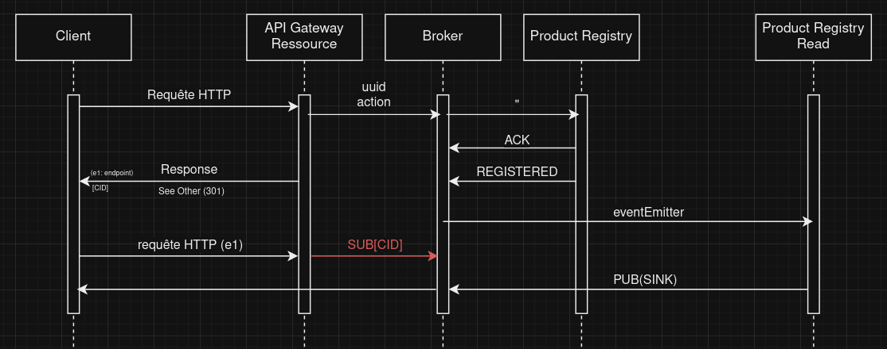

# TP Exercice 1: Analysez l'application

L'objectif de cet exercice est d'analyser l'application Order flow et ses microservices. Vous apprendrez à comprendre les concepts principaux et comment ils sont implémentés dans les microservices.

**temps estimé** : 1 heure

**difficulté** : débutant

## Tâche 1 : Ségrégation des responsabilités

L'application Order flow est un ensemble de microservices qui doivent implémenter plusieurs domaines métiers. Comparé aux applications monolithiques traditionnelles, les microservices sont conçus pour être petits et concentrés sur un domaine métier spécifique. De plus, comme l'application utilise des modèles spécifiques, la ségrégation des responsabilités peut être plus fine que d'habitude.

## Tâche 1 : Questions

1. Quels sont les principaux domaines métiers de l'application Order flow ?

*astuce* : Consultez les fichiers de cartographie de contexte dans le dossier `doc`.

Les principaux domaines sont `SUPPORTING_DOMAIN` et `GENERIC_SUBDOMAIN`.

Lorsqu'on souhaite supporter nos `CORE_DOMAIN`, on doit créer des `SUPPORTING_DOMAIN` pour consolider les existantes. Or, si nous souhaitons utiliser des domaines déjà utilisés, on doit les regrouper dans un `GENERIC_SUBDOMAIN`.

2. Comment les microservices sont-ils conçus pour implémenter les domaines métiers ?

*astuce* : Consultez l'architecture des microservices et les noms des packages dans les dossiers `apps` et `libs`.

Les microservices sont conçus cloisonnés par domaine métier (concentré sur une fonctionnalités). 

_Exemple:_ Registre de gestion des produits

Chaque microservice est responsable d'un domaine métier. 

Cela permet lors du développement de se concentrer sur un seul domaine métier, sans influer sur les autres domaines métiers.
Cela permet également une meilleure scabilité horizontale.

3. Quelles sont les responsabilités des conteneurs de code `apps/of-api-gateway`, `apps/of-product-registry-microservices/product.registry`, `apps/of-product-registry-microservices/product.registry.read`, `libs/event-sourcing`, `libs/published-language` ?

*astuce* : Vous pouvez observer les fichiers de cartographie de contexte dans le dossier `doc` ainsi qu'interpréter le code dans les dossiers `apps` et `libs`.

Les conteneurs de code sont responsables de l'implémentation des domaines métiers, indépendamment des autres domaines.

Ils dialoguent entre requêtes HTTP, avant qu'elles soient parsées et placé dans un message. Ce message est placé dans un _topic_, avant de l'envoyer sur l'api gateway.

Ainsi, les microserices peuvent s'abonner à des canaux de communications pour recevoir les messages, grpace à un _bus de messages (Message Broker)_.

Le _Message Broker_ se charge de **centraliser** les messages, et de les **distribuer** aux microservices abonnés.

Ainsi, les publishers publie des messages sur un _topic_, et les subscribers s'abonnent à un _topic_ pour recevoir les messages.

Conteneurs de codes :

* **product.registry** : microservice responsable de la gestion des produits, ainsi que les mutations de ces produits.

* **product.registry.read** : microservice responsable de la lecture des produits.

* **event-sourcing** : Il permet d'enregistrer les transitions d'états d'une entitée dans le temps, il conserve un historique pour ordonner l'entité. Ces événements sont stockés en base de données.

* **published-language** : Sert à définir les entités par contexte, afin que tous les microservices puissent les comprendre, et s'en servir.

## Tâche 2 : Identifier les concepts principaux

L'application Order flow utilise des modèles spécifiques pour implémenter les domaines métiers. Ces modèles sont basés sur les principes de la conception pilotée par le domaine (DDD) et de l'architecture pilotée par les événements (EDA).

Vous devez identifier les concepts principaux utilisés dans l'application Order flow.

## Tâche 2 : Questions

1. Quels sont les concepts principaux utilisés dans l'application Order flow ?

* Matéralisation des logiques métiers
* Enregistrements des événements (transitions entres les états)
* Architecture des évènements
* Ségrégation des responsabilités entre les commandes, et les queries

2. Comment les concepts principaux sont-ils implémentés dans les microservices ?

::: astuce
Identifiez les "parties mobiles" de l'application, telles que la sémantique des espaces de noms et les structures de code. Identifiez si un concept ou un modèle spécifique est directement implémenté ou si une solution générique est utilisée (par exemple, une bibliothèque, un framework, une base de données, un service/logiciel tiers). Vous pouvez également vous appuyer sur l'observation des fichiers de déclaration de dépendances (cf. [Gradle](https://docs.gradle.org/current/userguide/userguide.html)).
:::

::: avertissement
Cette question nécessite de faire des recherches et de comprendre la structure du code.
Cependant, vous pouvez également vous appuyer sur la [présentation du projet](../presentation-projet) pour vous aider à clarifier les sujets de la question.
:::

Technologies utilisées :

* **Quarkus** : framework Java (gestion des microservices, couche applicatives, requêtes HTTP)
* **Pulsar** : Lien entres les microservices, pour qu'ils soient découplés (Message Broker)
* **event-sourcing** : enregistrement des événements
* **MongoDB** : gestion de persistance
* **Gradle** : gestion de dépendances

3. Que fait la bibliothèque `libs/event-sourcing` ? Comment est-elle utilisée dans les microservices (relation entre métier et structure du code) ?

...

4. Comment l'implémentation actuelle de l'event-sourcing assure-t-elle la fiabilité des états internes de l'application ?

L'**agrégat ID** et son sa **version** associée, permet de garantir l'ordonnancement des événements. Ainsi, les événements sont stockés dans l'ordre, et sont traités dans l'ordre.

## Tâche 3 : Identifier les problèmes de qualité

L'application Order flow n'est pas encore complète ni entièrement fonctionnelle. Il vous incombe d'améliorer la conception et la qualité de l'implémentation de l'application et, si nécessaire, d'implémenter les fonctionnalités manquantes.

Vous devez identifier les problèmes de qualité dans l'application Order flow. Pour ce faire, vous devez utiliser les outils suivants :
- [SonarLint](https://www.sonarlint.org/)
- Analyser la cohérence du code avec la [présentation du projet](../presentation-projet) et la cartographie de contexte
- Vérifier la sémantique du code avec sa déclaration métier et les standards de codage

::: avertissement
Vous ne devez pas corriger les problèmes de qualité dans cet exercice. L'objectif est d'identifier les problèmes de qualité et de comprendre comment améliorer la conception et la qualité de l'implémentation de l'application. Vous pouvez éventuellement fournir des extraits de code pour illustrer vos conclusions.
:::

::: astuce
Vous pouvez appeler le professeur si vous avez besoin d'aide pour identifier les problèmes de qualité. N'hésitez pas à demander une vérification régulière pendant les sessions.
:::

::: astuce
Vous pouvez ajuster la configuration de SonarLint pour correspondre aux standards de codage du projet (par exemple, indentation, conventions de nommage, etc.). Le dépôt du projet repose sur Quarkus et cela implique certains standards de codage spécifiques.
Faites également attention à traiter tous les problèmes signalés par SonarLint, même s'ils ne sont pas directement liés à la qualité du code (une explication peut être suffisante dans certains cas).
:::

* Attributs en public dans les classes, ce qui peut être dangereux pour la sécurité. Il faudrait faire des accesseurs pour les attributs, et ainsi les rendre privés. 

> On pourrait également utiliser des `Record` (Java 17+) pour les classes immuables, ce qui rend les champs privés et final par défaut.

* `ProductRegistryQueryResource` : Exception non catché, ce qui peut provoquer des erreurs non gérées avec l'utilisation d'exceptions génériques

* Déclarer les constantes dans un fichiers de configuration, pour éviter les valeurs en dur dans le code, et de les répéter.

* `ProductRegistryEventEntity` : l'ORM `panache` impose que les objets soient des entités, et que leurs champs associés soient en public. 

> Ainsi il faut mettre une exception à _Sonarlint_ pour ne pas avoir de warning.

* De même, cette classe n'a pas de _Javadoc_ pour expliquer les champs, et les méthodes. 

> Manque de commentaires global sur le code.

* Manque de tests unitaires, et de tests d'intégration.

> Ainsi il n'y a pas de moyen de vérifier que l'application n'a pas de régression après les ajouts de fonctionnalités.

> On place les tests unitaires sur les fonctions métiers

> Exemple de diagramme de séquence d'integration pour la création d'un produit :  

* `ProductRegistryService` : Différencier une erreur technique d'une erreur métier. Dans ce fichier de service (logique métier, on renvoie des exceptions)

**Erreur techniques :** effets de bords, et proviennent de l'extérieur

**Erreur métier :** proviennent de la logique métier, et sont gérées par le service