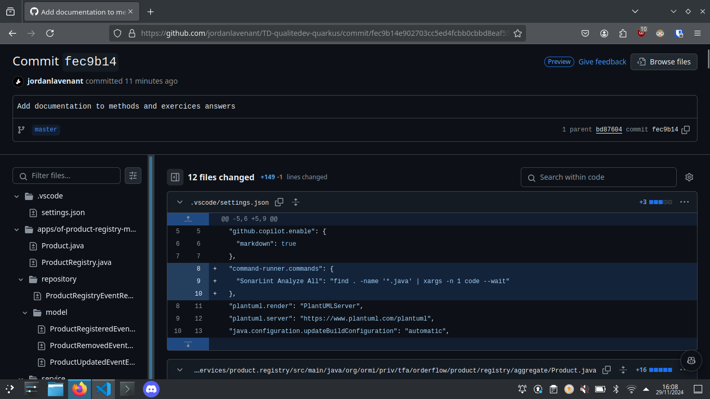
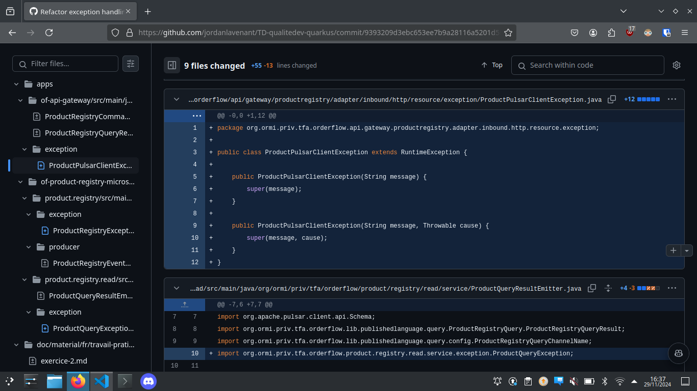

# TP Exercice 2: Corriger les problèmes de qualité du microservice du registre de produits (Côté écriture)

L'objectif de cet exercice est de corriger les problèmes de qualité du microservice du registre de produits. Vous apprendrez à améliorer la conception et la qualité de l'implémentation de l'application.

**portée** : microservice de registre de produits (of-product-registry-microservices:product.registry)

**temps estimé** : 2 heures

**difficulté** : intermédiaire

## Tâche 1 : Compléter les commentaires et la Javadoc

Le microservice de registre de produits est un microservice côté écriture qui gère les produits disponibles à la vente et leur disponibilité pour l'ajout dans un catalogue.

Le microservice n'est pas complètement documenté. Vous devez compléter les commentaires et la Javadoc du microservice.

_Aperçu du commit associé à la javadoc :_


## Tâche 2 : Corriger les RuntimeException paresseuses

Les RuntimeException ne sont pas recommandées car elles sont trop génériques. Vous devez remplacer les RuntimeException paresseuses par des exceptions plus spécifiques.

::: code-group
```java:line-numbers=216 {12} [ProductRegistryCommandResource.java]
try {
  // Define the channel name, topic and schema for the consumer
  final String channelName = ProductRegistryEventChannelName.PRODUCT_REGISTRY_EVENT.toString();
  final String topic = channelName + "-" + correlationId;
  // Create and return the subscription (consumer)
  return pulsarClients.getClient(channelName)
      .newConsumer(Schema.JSON(ProductRegistryEvent.class))
      .subscriptionName(topic)
      .topic(topic)
      .subscribe();
} catch (PulsarClientException e) {
  throw new RuntimeException("Failed to create consumer for product registry events.", e); // This is not okay!
}
```
:::

On peut remplacer les exceptions `RuntimeException` par des exceptions plus spécifiques en créant nos propres classes d'exception personnalisées.

_Aperçu du commit associé aux exceptions spécifiques :_


## Tâche 3 : Convertir les payloads des Entités (couche de persistance) en records

Le microservice de registre de produits utilise des entités pour persister les événements. Vous devez convertir les payloads des entités de classes en records pour améliorer la qualité du code.

::: code-group
```java:line-numbers=6 {4} [ProductRegisteredEventEntity.java]
/**
 * Payload for the event.
 */
public static class Payload { // Convert to record
  /**
   * The id of the product.
   */
  public String productId;
  /**
   * The name of the product.
   */
  public String name;
  /**
   * The description of the product.
   */
  public String productDescription;
}
```
:::

Convertir les classes en records permet de rendre les attributs immuables, permettant ainsi de garantir que les instances de ces classes ne peuvent pas être modifiées après leur création.


## Tâche 4 : Modifier les Entités (couche de persistance) pour utiliser des champs privés avec des accesseurs

Le microservice du registre de produits utilise des entités pour persister les événements. Vous devez modifier les entités pour utiliser des champs privés avec des accesseurs pour améliorer la qualité du code.

::: code-group
```java:line-numbers=24 {4} [ProductRegisteredEventEntity.java]
/**
 * The payload for the event.
 */
public Payload payload; // Should be changed to private and have accessors
```
:::

::: warning
Vérifiez que cette opération ne casse pas les mappers.
:::

## Tâche 4.1 : Champs publics sur les entités Panache

SonarLint peut signaler des avertissements concernant les champs publics sur les entités [Panache](https://quarkus.io/guides/mongodb-panache). Déterminez si les avertissements sont pertinents et justifiez votre réponse.

## Tâche 5 : Corriger les erreurs et avertissements signalés par SonarLint

Si ce n'est pas déjà fait, installez SonarLint dans votre IDE. Analysez le microservice du registre de produits avec SonarLint et corrigez les erreurs et avertissements signalés par SonarLint.

Faites attention à ne traiter que les problèmes nécessaires. Par exemple, vous pouvez ignorer les avertissements `field level injection` en raison des standards de Quarkus (cf [documentation Quarkus](https://quarkus.io/guides/cdi#what-does-a-bean-look-like)).

## Tâche 6 : Ajouter des tests d'intégration

Ajoutez une classe de tests d'intégration pour la classe `ProductRegistryCommandResource`. L'objectif est de tester l'intégration entre le client et le serveur via l'API HTTP.
Les tests d'intégration doivent couvrir les cas suivants :

- `POST /api/product/registry/registerProduct` : tester l'enregistrement d'un produit
  - Tester l'enregistrement d'un produit avec un produit valide
    - La réponse doit être une redirection vers le flux d'événements PR
  - Tester l'enregistrement d'un produit avec un produit invalide (champ manquant/DTO invalide)
    - La réponse doit être Bad request
  - Tester l'enregistrement d'un produit avec un produit nul (pas de corps)
    - La réponse doit être Bad request
- `POST /api/product/registry/updateProduct` : tester la mise à jour d'un produit
  - Tester la mise à jour d'un produit avec un produit valide
    - La réponse doit être une redirection vers le flux d'événements PR
  - Tester la mise à jour d'un produit avec un produit invalide (champ manquant/DTO invalide)
    - La réponse doit être Bad request
  - Tester la mise à jour d'un produit avec un produit nul (pas de corps)
    - La réponse doit être Bad request
- `POST /api/product/registry/deleteProduct` : tester la suppression d'un produit
  - Tester la suppression d'un produit avec un produit valide
    - La réponse doit être une redirection vers le flux d'événements PR
  - Tester la suppression d'un produit avec un produit invalide (champ manquant/DTO invalide)
    - La réponse doit être Bad request
  - Tester la suppression d'un produit avec un produit nul (pas de corps)
    - La réponse doit être Bad request

::: tip
Des modifications de code peuvent être nécessaires pour que les tests passent.

Pour les tests d'intégration, voir la [documentation Quarkus](https://quarkus.io/guides/getting-started-testing).
:::

## Tâche 7 : Ajouter des tests unitaires

Ajoutez une classe de tests unitaires pour la classe `ProductRegistry`. L'objectif est de tester la logique métier du microservice.
Les tests unitaires doivent couvrir les cas suivants :

- Méthode `handle` : tester la gestion d'une commande de registre de produits
  - Tester la gestion d'une commande de registre de produits valide
    - Le produit doit être enregistré
    - Le produit doit être mis à jour
    - Le produit doit être supprimé
  - Tester la gestion d'une commande de registre de produits nulle
    - La commande doit échouer
- Méthode `apply` : tester l'application d'un événement de registre de produits
  - Tester l'application d'un événement de registre de produits valide
    - Le produit doit être enregistré
    - Le produit doit être mis à jour
    - Le produit doit être supprimé
  - Tester l'application d'un événement de registre de produits nul
    - L'événement doit échouer
- Méthode `getVersion` : tester la version du registre de produits
  - Tester la version du registre de produits
    - La version doit être la même que celle définie
  - Tester la version du registre de produits après une mise à jour
    - La version doit avoir été incrémentée
- Méthode `hasProductWithId` : tester la présence d'un produit avec un ID
  - Tester la présence d'un produit avec un ID existant
    - Le produit doit être trouvé
  - Tester la présence d'un produit avec un ID inexistant
    - Le produit ne doit pas être trouvé
- Méthode `hasProduct` : tester la présence d'un produit
  - Tester la présence d'un produit avec un produit existant
    - Le produit doit être trouvé
  - Tester la présence d'un produit avec un produit inexistant
    - Le produit ne doit pas être trouvé
- Méthode `isProductNameAvailable` : tester la disponibilité d'un nom de produit
  - Tester la disponibilité d'un nom de produit avec un nom disponible
    - Le nom doit être disponible
  - Tester la disponibilité d'un nom de produit avec un nom indisponible
    - Le nom doit être indisponible

::: tip
Vous devrez peut-être utiliser le mocking pour isoler les tests unitaires. Pour l'utilisation du mocking des Beans CDI de Quarkus, voir la [documentation Quarkus](https://quarkus.io/guides/getting-started-testing#mock-support).
:::
